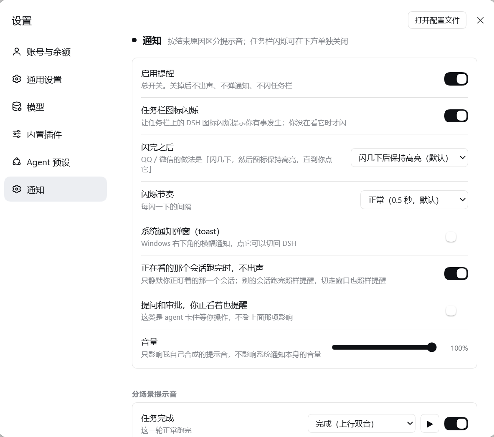

# dsh-notify-cues

**Windows notifications for [DeepSeek Harness](https://github.com/deepseek-ai/deepseek-harness) that tell you *why* a turn ended** — finished, interrupted, failed, out of budget — each with its own chime, instead of reporting every stop as "task complete".

Pure PowerShell notification runner: **no .NET desktop runtime, no audio assets, no helper executable.** All six chimes are synthesized on the fly.

[中文](README.md) | English

> The plugin is aimed at Chinese users first, so the default README is Chinese:
> [README.md](README.md). This file is the English translation.



---

## The problem

Every Windows notification plugin for DSH decides "done" from `agent/status → idle`. That is true when a turn finishes **and** when you press stop. So interrupting a task gives you a cheerful "task complete" toast.

The reason is already in the session log — DSH appends it itself:

```js
this.session.append("turn/end", { turn, reason: turnEnds })
```

`reason.kind` comes from `TurnEndReasonMap`, and a cancellation carries a nested cause:

```ts
type TurnEndReason     = 'completed' | 'aborted' | 'error' | 'max-tokens'
                       | 'interrupted' | 'blocked' | 'forked'
type TurnEndCancelCause = AgentCancelCause | { kind: 'legacy' }
type AgentCancelCause   = { kind: 'user' } | { kind: 'parent' }
                        | { kind: 'hook'; reason: string } | { kind: 'disposed' }
```

Pressing stop is `{ kind: 'aborted', reason: { kind: 'user' } }`. The information was always there; this plugin reads it.

## Six situations, six chimes

| Situation | Signal | Default chime | Sounds like |
|---|---|---|---|
| Completed | `completed` | `completed` | D5→A5 rising pair |
| **Interrupted** | `aborted` + `reason.kind === 'user'` | `interrupted` | A5→A4 falling, cut short |
| Failed | `error` | `error` | low, dissonant, falling |
| Output limit hit | `max-tokens` | `maxTokens` | three sharp pips |
| Blocked | `blocked`, or `aborted` + `reason.kind === 'hook'` | `blocked` | flat double knock |
| **Your input is needed** | `approval/asked`, `ask_user_question` | `attention` | E5-G5-B5 arpeggio |

`aborted` with `parent` (a delegating agent cancelled its child) or `disposed` (session teardown) stays **deliberately silent** — that is lifecycle noise, not news. `TurnEndReasonMap` is documented as merge-extensible by other packages, so an unrecognized `kind` is silent rather than guessed at.

## Taskbar behaviour: the chat-app pattern

Flashes a few times to catch your eye, then **stops animating but leaves the taskbar button lit** until you come back — the same thing QQ and WeChat do.

| `flashAfter` | Behaviour |
|---|---|
| `holdUntilFocused` *(default)* | Flash 3×, then hold the attention highlight until focused |
| `stop` | Flash 3× and stop |
| `keepFlashing` | Animate until focused |

Windows never flashes a foreground window, so none of this fires while you are already looking at DSH.

## Settings page

Registers a section into DSH's own Settings dialog (through the `settings.section` slot), not a bespoke popup:

- master switch · taskbar flash · toast — independent
- flash count, pace, and what happens after the flash
- **"stay quiet when the conversation on screen finishes"** — see below
- volume
- **per-situation enable + sound picker + preview button**

Every control persists immediately. No code editing, no restart.

### Quiet means *this* conversation, not *the window*

The rule is not "silence everything while the page is focused". The client reports which session the main view is showing, and the host silences a completion **only when the finishing session is the one you are reading**:

| You are… | A turn finishes | Result |
|---|---|---|
| reading session A | session A | quiet |
| reading session A | **session B** | **notifies** |
| in the settings dialog | any session | **notifies** |
| switched to another app | any session | notifies |
| a question or approval arrives | — | always notifies |

A missed chime is worse than a redundant one, so the presence channel fails open: if the browser never reports, notifications fire.

## Install

Requires Windows 10/11.

### Into a profile

```powershell
# 1. copy the plugin into your profile
$dest = Join-Path $env:USERPROFILE '.dsh\profiles\<profile>\node_modules\dsh-notify-cues'
New-Item -ItemType Directory -Force -Path $dest | Out-Null
Copy-Item package.json, cordis.patch.yml, lib -Destination $dest -Recurse -Force

# 2. print the loader specifier for step 3
#    `name` MUST be a file:// URL: the Cordis loader calls a bare import(name),
#    and a filesystem path fails with ERR_UNSUPPORTED_ESM_URL_SCHEME.
node -e "console.log(require('node:url').pathToFileURL(process.argv[1]).href)" "$dest\lib\index.js"
```

Append to `~/.dsh/profiles/<profile>/cordis.patch.yml`, substituting the URL printed above:

```yaml
- insert:
    - id: dsh-notify-cues
      name: 'file:///.../node_modules/dsh-notify-cues/lib/index.js'
      inject: ['subprocess', 'webServer']
      config:
        notifications: true
```

Then **fully restart** DeepSeek Harness and open **Settings → Notifications**.

### Local development mount

If your profile is not owned by the desktop application, you can mount a checkout directly and get hot reload:

```powershell
dsh --profile <name> --patch /path/to/dev.patch.yml web
```

`dev.patch.yml` ships with a `REPLACE/WITH` placeholder for `name`. A profile the desktop app owns is refused with `profile "X" is managed exclusively by the Electron application` — install into it instead.

## Configuration

`~/.dsh/dsh-notify-cues.json`, edited through the settings page or by hand. Re-read on every notification, so a hand edit takes effect immediately.

| Field | Default | Meaning |
|---|---|---|
| `notifications` | `true` | Master switch: no sound, no toast, no flash |
| `flash` | `true` | Taskbar flash |
| `flashCount` | `3` | Opening burst length |
| `flashTimeout` | `500` | Milliseconds per pulse |
| `flashAfter` | `holdUntilFocused` | `stop` · `holdUntilFocused` · `keepFlashing` |
| `toast` | `true` | System notification popup |
| `volume` | `1` | Chime volume, 0.1–1.0 |
| `quietOnForeground` | `true` | Quiet only for the conversation you are reading |
| `alwaysNotifyAttention` | `true` | Questions and approvals ignore the rule above |
| `dedupMs` | `1500` | Repeat-notice window, scoped per (session, situation) |
| `per.<situation>.enabled` | `true` | Switch for one situation |
| `per.<situation>.toast` | `true` | Toast for one situation |
| `per.<situation>.sound` | situation name | Tone name, `ding`, `none`, or a `.wav` path |

Situation keys: `completed`, `interrupted`, `error`, `max-tokens`, `blocked`, `attention`.

### HTTP API

Same-origin only (`Sec-Fetch-Site` checked; cross-site gets 403).

| Endpoint | Method | Purpose |
|---|---|---|
| `/dsh-notify-cues/config` | GET/POST | Read / merge-patch the config |
| `/dsh-notify-cues/presence` | GET/POST | Browser presence: `{visible, focused, viewedSessionId}` |
| `/dsh-notify-cues/test?scene=<name>` | GET | Fire a real notification now |
| `/dsh-notify-cues/keys` | GET | Situation and tone names |

## Two deliberate design decisions

**The debounce is scoped per (session, situation), not per session.** The first implementation used a session-wide window; a test immediately caught a real bug — an approval prompt followed by a failure would swallow the failure notice. Only a *repeated notice of the same situation* is suppressed now.

**An answered question suppresses the following "completed" chime, but never a failure or an interruption.** Answering resumes the turn, which then ends as `completed`; chiming "done" right after you clicked is pure noise. If that turn instead fails or is interrupted, that is real news and still fires.

## Testing

```powershell
node test/run.mjs                              # logic suite
node test/client-contract.mjs lib/client.js    # browser bundle contract
node test/manifest.mjs package.json            # manifest vs installed harness
node test/patch-shape.mjs cordis.patch.yml dev.patch.yml
node test/patch-loadable.mjs dev.patch.yml
node test/sim-append.mjs                       # profile patch stays valid
```

`test/run.mjs` is a small in-process runner rather than `node --test`: the DSH file sandbox forbids named pipes, and the built-in runner spawns its child over one.

Checks that need a local harness install (its `app.asar`) report `skipped` instead of failing when it is absent. Point them at a different install with `DSH_ASAR=/path/to/app.asar`.

The pure-logic suite covers the situation mapping (all five abort causes), the gating rules, config round-tripping, argument construction, and end-to-end dispatch through a fake plugin context — including several cases that pin "an interruption must never report as completed".

## Known limitations

- **Windows only.** The notifier drives WinRT toasts and `FlashWindowEx`.
- **The first toast registers an AppUserModelID.** An unpackaged process has no package identity, so Windows drops toasts (`0x80073D54`) until the AUMID key and a Start Menu shortcut exist. The plugin creates a dedicated `DeepSeek Harness Notifications.lnk` — deliberately *not* `DeepSeek Harness.lnk`, which belongs to the desktop client installer.
- **No in-toast answering.** `ask_user_question` gets a normal toast plus flash; you answer in the DSH UI. The interactive dropdown is what forces a .NET dependency, which this plugin avoids on purpose.
- The taskbar "hold" highlight relies on `FLASHW_TIMERNOFG` without the animation flag. Windows 11 no longer exposes the old `WS_EX_FLASHING` bit, so this cannot be asserted programmatically — it was confirmed by eye on one machine. If it does not hold for you, use `keepFlashing` or `stop`.
- Developed against DSH `0.2.0-rc.2`. An older plugin in this ecosystem notes that `0.1.0-rc.6` emits no `turn/end` at all; on such a version only the foreground heuristics would work.

## Repository layout

```
dsh-notify-cues/
├── lib/
│   ├── index.js          # host: turn/end mapping, gating, config + presence API
│   ├── client.js         # browser: settings section + presence reporter
│   └── notify.ps1        # tone synthesis, WinRT toast, taskbar flash
├── cordis.patch.yml      # bundle patch for package installs
├── dev.patch.yml         # hot-reload overlay (fill in the name: placeholder)
├── docs/
│   ├── DSH-API-CONTRACTS.md  # verified DSH 0.2.0-rc.2 plugin contracts
│   ├── asar.cjs              # helper for reading app.asar
│   └── probe-asar.mjs        # in-memory full-text search over app.asar
└── test/                 # see Testing
```

`docs/DSH-API-CONTRACTS.md` is a line-cited reference for the contracts this plugin depends on: the `session/event` listener signature, the full `turn/end` type tree, the slot API (which `kind` requires which option, and how `inject` becomes props), the `webServer` route contract, and the host plugin export shape. Handy when extending it.

## Credits

Built after reading two plugins in the same ecosystem, both of which had already solved problems this one had to solve:

- [**dsh-notify-win**](https://github.com/Andyqwe44/dsh-notify-win) — WinRT toast construction, the AppUserModelID self-registration dance (and why the shortcut name must not collide with the installer's), and the `EnumWindows` + `FlashWindowEx` approach.
- [**aokamoaki/dsh-notify**](https://github.com/aokamoaki/dsh-notify) — per-situation sound types, and the insight that "input needed" notices must bypass foreground suppression.

Neither is a dependency and no code was copied; their sources and READMEs were read as prior art.

## License

MIT — see [LICENSE](LICENSE).
